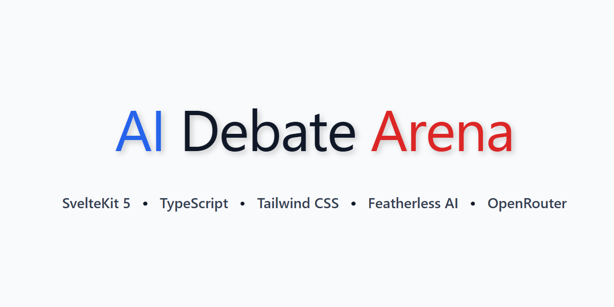
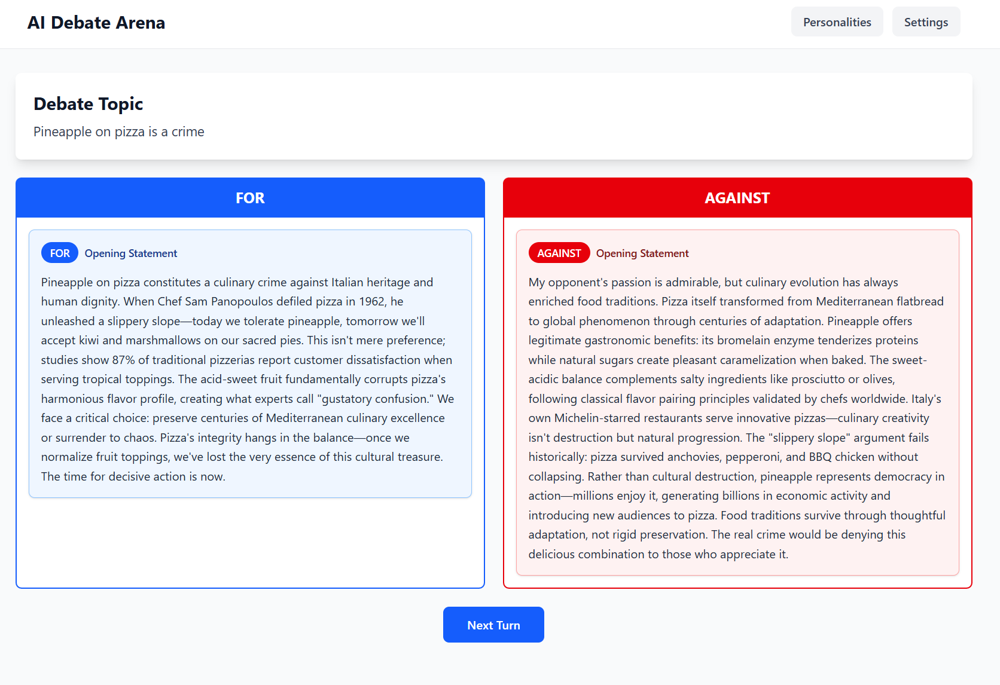

# Debate Corner



An AI debate application where two AI agents with distinct personalities argue opposing sides of user-provided topics, evaluated by three AI judges.

## Features

- **AI vs AI Debates**: Watch two language models debate each other on any topic
- **Dynamic Personalities**: 33 distinct debate personalities randomly assigned to debaters, including:
  - **Classic Styles**: Honest, Academic, Manipulative, Strawman Artist, Emotional, Pedantic, Zealot, Ignorant
  - **Internet Archetypes**: Debatebro, Twitter Reply Guy, Reddit Scholar, TikTok Activist, YouTube Essayist, Pol User, Tumblr Activist
  - **Argument Styles**: Gish Galloper, Sophist, Whataboutist, Concern Troll, Bad Faith Actor, Contrarian, Anecdotalist
  - **Ideological Approaches**: Ideologue, Centrist Smuggler, Radical Feminist, Pragmatist, Folksy Populist
  - **Unique Perspectives**: Data Fetishist, Doomer, Optimist Dismisser, Nothing Ever Happens, Conspiracy Analyst, Regular Guy
- **Judge Personalities**: 5 unique judge personalities that evaluate debates differently:
  - **Logic Purist** - Values logical consistency and formal reasoning
  - **Harsh Critic** - Unforgiving evaluator with high standards
  - **Bleeding Heart** - Empathetic and values emotional resonance
  - **Pushover** - Easily swayed by confident rhetoric
  - **Wild Card** - Unpredictable and unconventional judging criteria
- **Structured Format**: Opening statements → 2 rounds of rebuttals → Judge evaluation
- **Streaming Responses**: Real-time LLM response streaming
- **Customizable Settings**:
  - Select different models for each debater and judge
  - Choose specific personalities or let them be randomly assigned
- **Three-Judge System**: AI judges independently evaluate arguments and determine the winner



## Tech Stack

- **Framework**: SvelteKit 5 (using Svelte 5 runes)
- **Styling**: Tailwind CSS 4
- **LLM Providers**: [Featherless AI](https://featherless.ai/) or [OpenRouter](https://openrouter.ai/)
- **Language**: TypeScript

## Setup

1. Clone the repository and install dependencies:

```sh
npm install
```

2. Create a `.env` file in the root directory and add your API key(s):

You can use either Featherless AI or OpenRouter (or both). At least one is required.

```env
# For Featherless AI
FEATHERLESS_API_KEY=your_featherless_api_key_here

# For OpenRouter (optional)
OPENROUTER_API_KEY=your_openrouter_api_key_here
```

**Getting API Keys:**
- **Featherless AI**: Sign up at [featherless.ai](https://featherless.ai/), subscribe to a plan, and generate an API key
- **OpenRouter**: Sign up at [openrouter.ai](https://openrouter.ai/), add credits, and generate an API key

3. Start the development server:

```sh
npm run dev
```

4. Open http://localhost:5173 in your browser

## Usage

1. **Configure Settings** (optional):
   - Click "Settings" in the navigation
   - Choose your LLM provider (Featherless AI or OpenRouter)
   - Select models for each debater and judge from available models
   - Choose response length (short: 75-150 words, medium: 150-250 words, long: 250-400 words)
   - Fine-tune LLM parameters (temperature, top-p, penalties, etc.) for each agent
   - Settings persist in localStorage

2. **View Personalities** (optional):
   - Click "Personalities" to see all 33 debate personalities and their behavioral prompts
   - Personalities can be manually selected or randomly assigned at the start of each debate

3. **Start a Debate**:
   - Enter a debate topic on the home page
   - Click "Start Debate"
   - Two random personalities will be assigned
   - AI 1 argues FOR, AI 2 argues AGAINST

4. **Watch the Debate**:
   - Opening statements from both sides
   - Click "Next" to progress through each turn
   - Two rounds of rebuttals where AIs respond to each other
   - Responses stream in real-time

5. **See the Verdict**:
   - Three AI judges independently evaluate the debate
   - Each judge provides their reasoning and declares a winner
   - Final tally determines the debate winner

## Project Structure

```
src/
├── lib/
│   ├── components/          # Svelte components
│   │   ├── DebateSetup.svelte
│   │   ├── DebateStage.svelte
│   │   ├── DebateTurn.svelte
│   │   ├── JudgeResults.svelte
│   │   ├── ModelSelector.svelte
│   │   └── LLMParametersControl.svelte
│   ├── personalities/       # 33 debate personality JSON definitions
│   │   ├── honest.json
│   │   ├── academic.json
│   │   ├── debatebro.json
│   │   ├── twitter-reply-guy.json
│   │   └── ... (and 29 more)
│   ├── judge-personalities/ # 5 judge personality JSON definitions
│   │   ├── logic-purist.json
│   │   ├── harsh-critic.json
│   │   ├── bleeding-heart.json
│   │   ├── pushover.json
│   │   └── wild-card.json
│   ├── server/
│   │   └── featherless.ts   # Featherless API wrapper
│   ├── stores/
│   │   └── models.ts        # Available models store
│   └── types/
│       └── index.ts         # TypeScript type definitions
├── routes/
│   ├── api/
│   │   ├── debate/
│   │   │   ├── stream/      # Streaming debate endpoint
│   │   │   └── +server.ts   # Non-streaming debate endpoint
│   │   ├── judge/           # Judge evaluation endpoint
│   │   └── models/          # Available models endpoint
│   ├── personalities/       # Personalities view page
│   ├── settings/            # Settings configuration page
│   └── +page.svelte         # Main debate page
└── app.css                  # Global styles
```

## How It Works

1. **Debate Flow**: The debate progresses through predefined turns (AI 1 opening → AI 2 opening → AI 1 round 1 → AI 2 round 1 → AI 1 round 2 → AI 2 round 2)

2. **Personality Assignment**: Each debate can randomly assign from 33 debate personalities in `/src/lib/personalities/*.json` or let users manually select personalities. Judges are assigned from 5 judge personalities in `/src/lib/judge-personalities/*.json`

3. **Streaming**: Responses use Server-Sent Events (SSE) to stream LLM output chunk-by-chunk, preserving formatting with JSON serialization

4. **Sequential Judges**: Due to Featherless API concurrency limits, judges evaluate sequentially rather than in parallel

5. **Prompt Engineering**:
   - Opening statements prevent premature opponent references
   - Rebuttals encourage engagement with actual arguments made
   - Strict word count enforcement based on response length setting
   - Rich personality prompts guide debate behavior

## Building for Production

```sh
npm run build
```

Preview the production build:

```sh
npm run preview
```

> To deploy, you may need to install an [adapter](https://svelte.dev/docs/kit/adapters) for your target environment.

## Contributing

To add new debate personalities:

1. Create a new JSON file in `/src/lib/personalities/`
2. Follow the structure:
```json
{
  "name": "Personality Name",
  "description": "Brief description",
  "systemPromptAddition": "Detailed behavioral instructions..."
}
```
3. The personality will be automatically discovered and available in debates

To add new judge personalities:

1. Create a new JSON file in `/src/lib/judge-personalities/`
2. Follow the same structure as debate personalities
3. The judge personality will be automatically discovered and available for selection

## License

MIT
